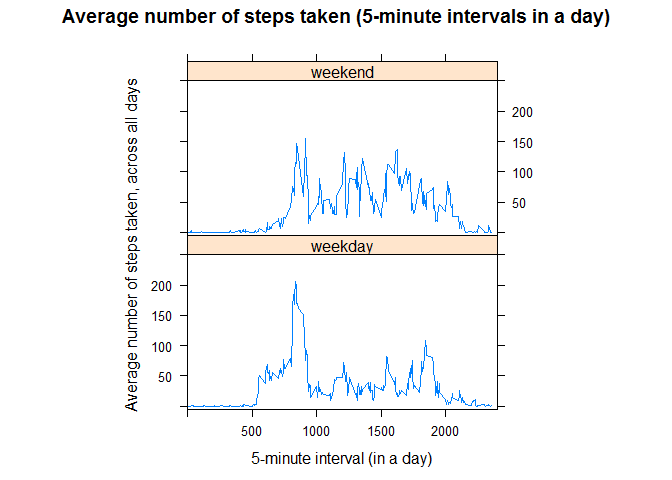

# Reproducible Research: Peer Assessment 1
ckkhan@gmail.com  
2 August 2016  


***

**Loading and preprocessing the data**

1. Retrieve a fresh copy of the data set, if missing
    
    ```r
        url<-"https://d396qusza40orc.cloudfront.net/repdata%2Fdata%2Factivity.zip"
        zfn<-"activity.zip"
        fn<-"activity.csv"
        if(!file.exists(fn)) {
            download.file(url, zfn, mode="wb")
            unzip(zfn, overwrite=TRUE, exdir=getwd())
        }
    ```

2. Load data into R
    
    ```r
        mydata<-read.csv(fn, colClasses=c("integer","character","integer"))
    ```

3. Convert date (char) to date
    
    ```r
        mydata$date<-as.POSIXct(mydata$date, format="%Y-%m-%d")
    ```

4. Summary of the data & structure
    
    ```r
        str(mydata)
    ```
    
    ```
    ## 'data.frame':	17568 obs. of  3 variables:
    ##  $ steps   : int  NA NA NA NA NA NA NA NA NA NA ...
    ##  $ date    : POSIXct, format: "2012-10-01" "2012-10-01" ...
    ##  $ interval: int  0 5 10 15 20 25 30 35 40 45 ...
    ```
    
    ```r
        summary(mydata)
    ```
    
    ```
    ##      steps             date               interval     
    ##  Min.   :  0.00   Min.   :2012-10-01   Min.   :   0.0  
    ##  1st Qu.:  0.00   1st Qu.:2012-10-16   1st Qu.: 588.8  
    ##  Median :  0.00   Median :2012-10-31   Median :1177.5  
    ##  Mean   : 37.38   Mean   :2012-10-31   Mean   :1177.5  
    ##  3rd Qu.: 12.00   3rd Qu.:2012-11-15   3rd Qu.:1766.2  
    ##  Max.   :806.00   Max.   :2012-11-30   Max.   :2355.0  
    ##  NA's   :2304
    ```

<br>

**What is mean total number of steps taken per day?**

For this part of the assignment, missing values in the dataset will be ignored.

1. Total number of steps taken per day (sum steps by date)
    
    ```r
        dailysteps<-aggregate(steps ~ date, mydata, FUN=sum, na.action=na.omit)
        dailysteps
    ```
    
    ```
    ##          date steps
    ## 1  2012-10-02   126
    ## 2  2012-10-03 11352
    ## 3  2012-10-04 12116
    ## 4  2012-10-05 13294
    ## 5  2012-10-06 15420
    ## 6  2012-10-07 11015
    ## 7  2012-10-09 12811
    ## 8  2012-10-10  9900
    ## 9  2012-10-11 10304
    ## 10 2012-10-12 17382
    ## 11 2012-10-13 12426
    ## 12 2012-10-14 15098
    ## 13 2012-10-15 10139
    ## 14 2012-10-16 15084
    ## 15 2012-10-17 13452
    ## 16 2012-10-18 10056
    ## 17 2012-10-19 11829
    ## 18 2012-10-20 10395
    ## 19 2012-10-21  8821
    ## 20 2012-10-22 13460
    ## 21 2012-10-23  8918
    ## 22 2012-10-24  8355
    ## 23 2012-10-25  2492
    ## 24 2012-10-26  6778
    ## 25 2012-10-27 10119
    ## 26 2012-10-28 11458
    ## 27 2012-10-29  5018
    ## 28 2012-10-30  9819
    ## 29 2012-10-31 15414
    ## 30 2012-11-02 10600
    ## 31 2012-11-03 10571
    ## 32 2012-11-05 10439
    ## 33 2012-11-06  8334
    ## 34 2012-11-07 12883
    ## 35 2012-11-08  3219
    ## 36 2012-11-11 12608
    ## 37 2012-11-12 10765
    ## 38 2012-11-13  7336
    ## 39 2012-11-15    41
    ## 40 2012-11-16  5441
    ## 41 2012-11-17 14339
    ## 42 2012-11-18 15110
    ## 43 2012-11-19  8841
    ## 44 2012-11-20  4472
    ## 45 2012-11-21 12787
    ## 46 2012-11-22 20427
    ## 47 2012-11-23 21194
    ## 48 2012-11-24 14478
    ## 49 2012-11-25 11834
    ## 50 2012-11-26 11162
    ## 51 2012-11-27 13646
    ## 52 2012-11-28 10183
    ## 53 2012-11-29  7047
    ```

2. Histogram of the total number of steps taken each day
    
    ```r
        hist(dailysteps$steps, xlab="Steps taken in a day", main="Histogram of the total number of steps taken in a day", col="orange", ylim=c(0,30), labels=TRUE)
    ```
    
    <!-- -->

3. Mean and median of the total number of steps taken per day
    
    ```r
        summary(dailysteps$steps)
    ```
    
    ```
    ##    Min. 1st Qu.  Median    Mean 3rd Qu.    Max. 
    ##      41    8841   10760   10770   13290   21190
    ```

<br/>

**What is the average daily activity pattern?**

1. Time series plot of the 5-minute interval (x-axis) and the average number of steps taken, averaged across all days (y-axis)
    
    ```r
        intstepsavg<-aggregate(steps ~ interval, mydata, FUN=mean, na.action=na.omit)
        plot(intstepsavg$interval, intstepsavg$steps, type = "l", xlab="5-minute interval (in a day)", ylab="Number of steps taken, averaged across all days", main="Average number of steps taken (5-minute intervals in a day)", col="blue", ylim=c(0,250))
    ```
    
    <!-- -->


2. The 5-minute interval containing the maximum number of steps, on average across all the days in the dataset.
    
    ```r
        intstepsavg[which.max(intstepsavg$steps),]
    ```
    
    ```
    ##     interval    steps
    ## 104      835 206.1698
    ```

<br/>

**Imputing missing values**

1. The total number of missing values in the dataset (i.e. the total number of rows with **NA**s)
    
    ```r
        table(is.na(mydata$steps))
    ```
    
    ```
    ## 
    ## FALSE  TRUE 
    ## 15264  2304
    ```

2. Calculate median steps across all days for each 5-minute interval, ignoring missing values. These median values will be used to impute the missing values in the original dataset by matching 5-minute intervals.
    
    ```r
        intstepsmed<-aggregate(steps ~ interval, mydata, FUN=median, na.action=na.omit)
    ```

3. Fill in missing values in original data set with the median value from the corresponding 5-minute interval
    
    ```r
        options(warn=-1)
        mydata2<-mydata %>%
            group_by(interval) %>%
                mutate(steps=ifelse(is.na(steps), intstepsmed$steps[intstepsmed$interval==interval], steps))
        options(warn=0)
    ```

4. Histogram of the total number of steps taken each day (dataset with imputed values).
    
    ```r
        dailysteps2<-aggregate(steps ~ date, mydata2, FUN=sum, na.action=na.omit)
        hist(dailysteps2$steps, xlab="Steps taken in a day", main="Histogram of the total number of steps taken each day\n(with imputed values)", col="yellow", ylim=c(0,30), labels=TRUE)
    ```
    
    <!-- -->

5. The **mean** and **median** total number of steps taken per day.
    
    ```r
        summary(dailysteps2$steps)
    ```
    
    ```
    ##    Min. 1st Qu.  Median    Mean 3rd Qu.    Max. 
    ##      41    6778   10400    9504   12810   21190
    ```

Imputing missing data produced a different result from the earlier analysis with the following impact:

* frequency on the lowest range of the total number of steps in a day have increased.

* median and mean values are also lower than the data set without imputation.

My suspicion is that this is due to low median values used during imputation. Using mean values during imputation would likely fortify the medium ranges.

<br/>

**Are there differences in activity patterns between weekdays and weekends?**

For this part of the assignment will utilize the dataset with the filled-in missing values.

1. Create a new factor variable (weekdaytype) in the dataset with two levels - "weekday" and "weekend" indicating whether a given date is a weekday or weekend day.
    
    ```r
        mydata2$weekdaytype<-factor(ifelse(weekdays(mydata2$date) %in% c("Saturday","Sunday"), "weekend", "weekday"))
    ```

2. Panel plot containing a time series plot of the 5-minute interval (x-axis) and the average number of steps taken, averaged across all weekday days or weekend days (y-axis).
    
    ```r
        intstepsavg2<-aggregate(steps ~ interval*weekdaytype, mydata2, FUN=mean, na.rm=TRUE)
    
        xyplot(steps ~ interval | weekdaytype, data=intstepsavg2, type="l", xlab="5-minute interval (in a day)", ylab="Average number of steps taken, across all days", main="Average number of steps taken (5-minute intervals in a day)", xlim=c(0,2400), ylim=c(-5,250), aspect=1/2)
    ```
    
    <!-- -->

Looking at the plots, the differences between weekdays and weekends are quite noticeable:

* In the mornings (before 10am), there are more steps taken overall and earlier (beginning 5am) during the weekdays than the weekends. This is likely due to the measured person(s) sleeping in and being more leisurely on the weekends compared to getting to work.

* During work hours, there are fewer steps taken during the weekdays as compared to the weekends. This is likely due to the more sedentary nature of the measured person(s) job.


***

## Background

It is now possible to collect a large amount of data about personal movement using activity monitoring devices such as a [Fitbit](http://www.fitbit.com/), [Nike Fuelband](http://www.nike.com/us/en_us/c/nikeplus-fuelband), or [Jawbone Up](https://jawbone.com/up). These type of devices are part of the "quantified self" movement - a group of enthusiasts who take measurements about themselves regularly to improve their health, to find patterns in their behavior, or because they are tech geeks. But these data remain under-utilized both because the raw data are hard to obtain and there is a lack of statistical methods and software for processing and interpreting the data.

This assignment makes use of data from a personal activity monitoring device. This device collects data at 5 minute intervals through out the day. The data consists of two months of data from an anonymous individual collected during the months of October and November, 2012 and include the number of steps taken in 5 minute intervals each day.

The data for this assignment can be downloaded from this [link](https://d396qusza40orc.cloudfront.net/repdata%2Fdata%2Factivity.zip).

The variables included in this dataset are:

* **steps**: Number of steps taking in a 5-minute interval (missing values are coded as **NA**)

* **date**: The date on which the measurement was taken in YYYY-MM-DD format

* **interval**: Identifier for the 5-minute interval in which measurement was taken

The dataset is stored in a comma-separated-value (CSV) file and there are a total of 17,568 observations in this dataset.

***

## Assignment

This assignment will be described in multiple parts. You will need to write a report that answers the questions detailed below. Ultimately, you will need to complete the entire assignment in a **single R markdown** document that can be processed by **knitr** and be transformed into an HTML file.

Throughout your report make sure you always include the code that you used to generate the output you present. When writing code chunks in the R markdown document, always use **echo = TRUE** so that someone else will be able to read the code. **This assignment will be evaluated via peer assessment so it is essential that your peer evaluators be able to review the code for your analysis.**

For the plotting aspects of this assignment, feel free to use any plotting system in R (i.e., base, lattice, ggplot2)

Fork/clone the [GitHub repository created for this assignment.](http://github.com/rdpeng/RepData_PeerAssessment1) You will submit this assignment by pushing your completed files into your forked repository on GitHub. The assignment submission will consist of the URL to your GitHub repository and the SHA-1 commit ID for your repository state.

NOTE: The GitHub repository also contains the dataset for the assignment so you do not have to download the data separately.

<br/>

**Loading and preprocessing the data**

Show any code that is needed to

1. Load the data (i.e. **read.csv()**)

2. Process/transform the data (if necessary) into a format suitable for your analysis

<br/>

**What is mean total number of steps taken per day?**

For this part of the assignment, you can ignore the missing values in the dataset.

1. Calculate the total number of steps taken per day

2. If you do not understand the difference between a histogram and a barplot, research the difference between them. Make a histogram of the total number of steps taken each day

3. Calculate and report the mean and median of the total number of steps taken per day

<br/>

**What is the average daily activity pattern?**

1. Make a time series plot (i.e. **type = "l"**) of the 5-minute interval (x-axis) and the average number of steps taken, averaged across all days (y-axis)

2. Which 5-minute interval, on average across all the days in the dataset, contains the maximum number of steps?

<br/>

**Imputing missing values**

Note that there are a number of days/intervals where there are missing values (coded as **NA**). The presence of missing days may introduce bias into some calculations or summaries of the data.

1. Calculate and report the total number of missing values in the dataset (i.e. the total number of rows with **NA**s)

2. Devise a strategy for filling in all of the missing values in the dataset. The strategy does not need to be sophisticated. For example, you could use the mean/median for that day, or the mean for that 5-minute interval, etc.

3. Create a new dataset that is equal to the original dataset but with the missing data filled in.

4. Make a histogram of the total number of steps taken each day and Calculate and report the **mean** and **median** total number of steps taken per day. Do these values differ from the estimates from the first part of the assignment? What is the impact of imputing missing data on the estimates of the total daily number of steps?

<br/>

**Are there differences in activity patterns between weekdays and weekends?**

For this part the **weekdays()** function may be of some help here. Use the dataset with the filled-in missing values for this part.

1. Create a new factor variable in the dataset with two levels - "weekday" and "weekend" indicating whether a given date is a weekday or weekend day.

2. Make a panel plot containing a time series plot (i.e. **type = "l"**) of the 5-minute interval (x-axis) and the average number of steps taken, averaged across all weekday days or weekend days (y-axis). See the README file in the GitHub repository to see an example of what this plot should look like using simulated data.

***

## Submitting the Assignment

To submit the assignment:

1. Commit your completed **PA1_template.Rmd** file to the **master** branch of your git repository (you should already be on the **master** branch unless you created new ones)
2. Commit your PA1_template.md and PA1_template.html files produced by processing your R markdown file with knit2html() function in R (from the knitr package) by running the function from the console.
3. If your document has figures included (it should) then they should have been placed in the figure/ directory by default (unless you overrided the default). Add and commit the figure/ directory to your git repository so that the figures appear in the markdown file when it displays on github.
4. Push your **master** branch to GitHub.
5. Submit the URL to your GitHub repository for this assignment on the course web site.

In addition to submitting the URL for your GitHub repository, you will need to submit the 40 character SHA-1 hash (as string of numbers from 0-9 and letters from a-f) that identifies the repository commit that contains the version of the files you want to submit. You can do this in GitHub by doing the following

1. Going to your GitHub repository web page for this assignment
2. Click on the "?? commits" link where ?? is the number of commits you have in the repository. For example, if you made a total of 10 commits to this repository, the link should say "10 commits".
3. You will see a list of commits that you have made to this repository. The most recent commit is at the very top. If this represents the version of the files you want to submit, then just click the "copy to clipboard" button on the right hand side that should appear when you hover over the SHA-1 hash. Paste this SHA-1 hash into the course web site when you submit your assignment. If you don't want to use the most recent commit, then go down and find the commit you want and copy the SHA-1 hash.

***

## Review Criteria
***Repo***

1. Valid GitHub URL
2. At least one commit beyond the original fork
3. Valid SHA-1
4. SHA-1 corresponds to a specific commit


***Commit containing full submission***

1. Code for reading in the dataset and/or processing the data
2. Histogram of the total number of steps taken each day
3. Mean and median number of steps taken each day
4. Time series plot of the average number of steps taken
5. The 5-minute interval that, on average, contains the maximum number of steps
6. Code to describe and show a strategy for imputing missing data
7. Histogram of the total number of steps taken each day after missing values are imputed
8. Panel plot comparing the average number of steps taken per 5-minute interval across weekdays and weekends
9. All of the R code needed to reproduce the results (numbers, plots, etc.) in the report

***
```

